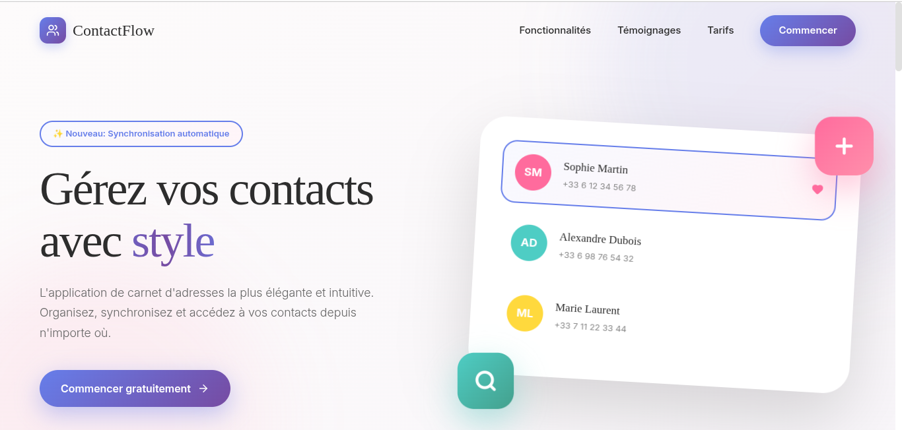

# Carnet d'adresses

Application MERN (Express + React) pour gérer un carnet de contacts avec authentification, création/édition/suppression de contacts, et une interface React côté client.

**Fonctionnalités principales**
- Authentification utilisateur (JWT)
- Gestion CRUD des contacts
- Recherche et favoris
- Interface React côté client (React Router)
- API Express avec MongoDB (Mongoose)

**Stack**
- Backend : Node.js, Express, Mongoose
- Frontend : React, React Router
- Base de données : MongoDB
- Outils : Vite, TypeScript

**Prérequis**
- Node.js (v18+ recommandé)
- npm ou yarn
- MongoDB (local ou service cloud)
- (Optionnel) Docker

**Installation (locale)**
1. Cloner le dépôt
2. Installer les dépendances

```bash
npm install
```

3. Créer un fichier d'environnement `.env` à la racine (voir variables ci-dessous).

**Variables d'environnement recommandées**
- `PORT` — port du serveur (ex: 3000)
- `MONGO_URI` — chaîne de connexion MongoDB
- `JWT_SECRET` — clé secrète pour les tokens JWT
- `CLIENT_URL` — URL du client (pour CORS si nécessaire)

Placez ces variables dans un fichier `.env` ou dans votre environnement d'exécution.

**Scripts utiles**
- `npm run dev` : lance le serveur (mode développement simple)
- `npm run dev:server` : relance le serveur automatiquement (watch)
- `npm run build` : construit le routage React (script lié à react-router)
- `npm run start` : démarre le serveur en production
- `npm run typecheck` : génère les types React Router et lance TypeScript

Exemples :

```bash
npm run dev
npm run dev:server
```

**Docker**
Le projet contient un `Dockerfile`. Pour construire et lancer l'image :

```bash
docker build -t carnet-adresses .
docker run -e MONGO_URI="<votre_mongo_uri>" -e JWT_SECRET="<secret>" -p 3000:3000 carnet-adresses
```

**Structure du projet (aperçu)**
- `app/` : code React (routes, composants, UI)
- `server/` et `server.ts` : API Express, modèles Mongoose, routes
- `public/`, `build/` : assets et build

**Déploiement**
- Préparer les variables d'environnement pour la production
- Construire et lancer le serveur (ou utiliser Docker)

**Tests**
Ce dépôt n'inclut pas encore de suite de tests automatisés. Ajouter des tests unitaires et d'intégration est recommandé.

**Contribution**
- Ouvrez une issue pour discuter des changements majeurs
- Créez des branches de fonctionnalités puis des PRs

**Contact**
Pour toute question, ouvrez une issue sur le dépôt.
